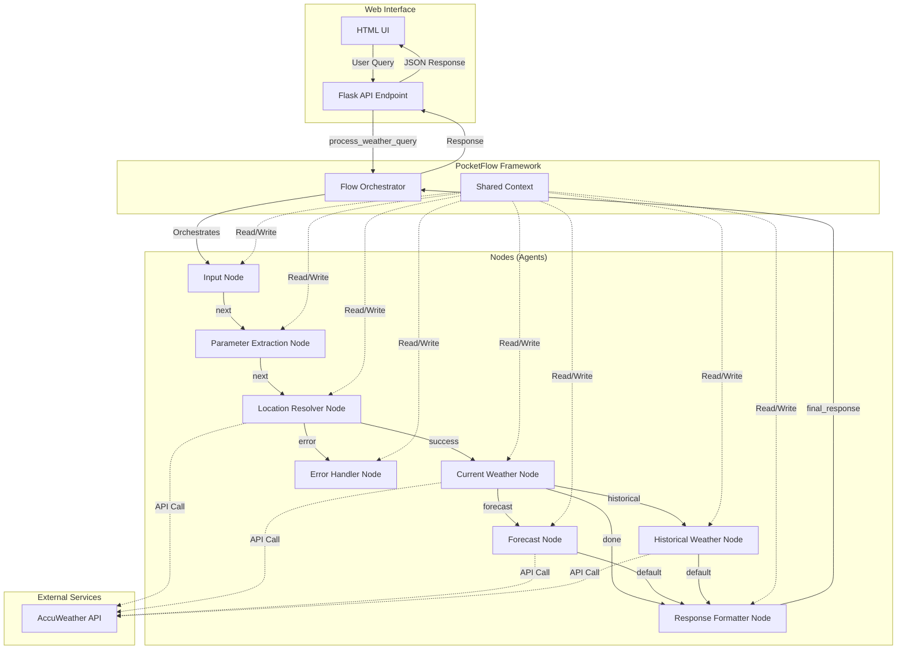

```mermaid
graph TD
    subgraph "Web Interface"
        UI[HTML UI]
        API[Flask API Endpoint]
    end

    subgraph "PocketFlow Framework"
        Flow[Flow Orchestrator]
        SharedContext[Shared Context]
    end

    subgraph "Nodes (Agents)"
        InputNode[Input Node]
        ParamExtraction[Parameter Extraction Node]
        LocationResolver[Location Resolver Node]
        CurrentWeather[Current Weather Node]
        Forecast[Forecast Node]
        Historical[Historical Weather Node]
        ResponseFormatter[Response Formatter Node]
        ErrorHandler[Error Handler Node]
    end

    subgraph "External Services"
        AccuWeather[AccuWeather API]
    end

    %% Flow connections
    UI -->|User Query| API
    API -->|process_weather_query| Flow
    Flow -->|Orchestrates| InputNode
    InputNode -->|next| ParamExtraction
    ParamExtraction -->|next| LocationResolver
    LocationResolver -->|success| CurrentWeather
    LocationResolver -->|error| ErrorHandler
    CurrentWeather -->|done| ResponseFormatter
    CurrentWeather -->|forecast| Forecast
    CurrentWeather -->|historical| Historical
    Forecast -->|default| ResponseFormatter
    Historical -->|default| ResponseFormatter
    
    %% Data flow
    SharedContext -.->|Read/Write| InputNode
    SharedContext -.->|Read/Write| ParamExtraction
    SharedContext -.->|Read/Write| LocationResolver
    SharedContext -.->|Read/Write| CurrentWeather
    SharedContext -.->|Read/Write| Forecast
    SharedContext -.->|Read/Write| Historical
    SharedContext -.->|Read/Write| ResponseFormatter
    SharedContext -.->|Read/Write| ErrorHandler
    
    %% External API calls
    LocationResolver -.->|API Call| AccuWeather
    CurrentWeather -.->|API Call| AccuWeather
    Forecast -.->|API Call| AccuWeather
    Historical -.->|API Call| AccuWeather
    
    %% Return flow
    ResponseFormatter -->|final_response| Flow
    Flow -->|Response| API
    API -->|JSON Response| UI
```
